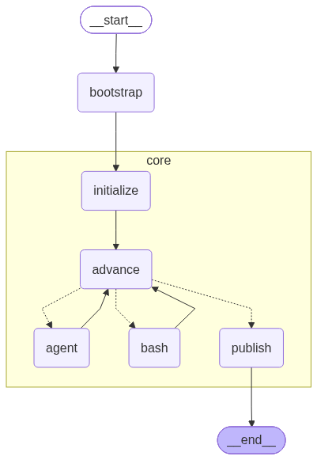

# LangGraph Agentic Workflow



_The exact graph served by [`langgraph dev`](#langgraph-studio-visual-debugging) / LangGraph Studio for the
`studio-demo` project, rendered directly from the compiled LangGraph JS graph object — the same 5 reusable
core nodes run every project workflow in this repo._

A local, API-triggered [LangGraph](https://github.com/langchain-ai/langgraphjs) agent system with a strict
split between **project-agnostic core orchestration** and **per-project workflow content**:

- **Core nodes** (`packages/workflow-core`) — reusable orchestration and execution primitives
  (`initialize`, `advance`, `agent`, `bash`, `publish`). Contain **zero** prompt text, shell commands, or
  domain logic.
- **Project workflows** (`projects/<id>/`) — ordered agent prompts, Bash scripts, inputs, and failure paths,
  defined per project as plain TypeScript + policy files. Adding a new project never requires touching core.

One `agent` node executes every prompt-driven step (planner, coder, reviewer, ...); one `bash` node executes
every project script. The workflow alone decides the order.

See [docs/INITIAL.md](docs/INITIAL.md) for the full design/architecture and
[docs/IMPLEMENTATION_PLAN.md](docs/IMPLEMENTATION_PLAN.md) for the milestone-by-milestone build plan and
manual E2E evidence.

## Status

Milestones **M0–M6** of the implementation plan are complete (repo skeleton, contracts, core runtime, agent
runtime, an example project, the HTTP API + operations layer, and credential-free observability). This is a
proof-of-concept, not a hardened production system — see
[docs/IMPLEMENTATION_PLAN.md](docs/IMPLEMENTATION_PLAN.md) for the definition of done and known follow-ups.

## Quick start

```bash
make install    # pnpm install (all workspace packages/apps/projects)
make build      # tsc -b, all packages + apps
make test       # vitest, all packages/apps (dry-run, no LLM calls, no network)
make lint       # eslint + prettier --check

AGENT_DRY_RUN=1 make run     # start the HTTP API (Fastify) on :8080, dry-run mode (no real LLM calls)
curl -s -XPOST localhost:8080/runs \
  -H 'Content-Type: application/json' \
  -d '{"project":"example-service","workflow":"example-service-code-review","task":"Add a health-check endpoint","model":"opencode/big-pickle"}'
# => {"runId": "..."}
curl -s localhost:8080/runs/<runId>        # status + per-step results
curl -s localhost:8080/runs/<runId>/trace  # per-node JSONL execution trace
curl -s localhost:8080/metrics             # run/step counters
make stop       # graceful shutdown, zero orphaned child processes
```

Unset `AGENT_DRY_RUN` (or set `AGENT_DRY_RUN=0`) to spawn real `opencode` agent processes and real bash
scripts instead of deterministic stubs — see [Dry-run vs. live](#dry-run-vs-live-mode) below.

## Architecture

```text
apps/
├── run-api/          POST /runs, GET /runs/:id, POST /runs/:id/cancel, GET /runs/:id/trace, GET /metrics
└── agent-service/     loads the project registry, compiles the graph once, executes runs, cancellation

packages/
├── workflow-core/     RunState, the 5 core LangGraph nodes, the graph, artifact store, checkpointer,
│                      project registry (load-time validation of workflow ↔ policy ↔ filesystem)
├── agent-runtime/      opencode process runner (NDJSON parsing), bash script runner, the dry-run stub
└── agent-contracts/    zod schemas shared by every layer (AgentResult, CommandResult, ArtifactRef)

projects/
├── example-service/    a realistic 9-step planner → coder → reviewer workflow (see docs/INITIAL.md)
├── studio-demo/        a tiny 4-step dummy pipeline for local LangGraph Studio exploration
└── __fixture__/        a throwaway 1-step project used by workflow-core's own tests

infra/
├── langgraph/          docker-compose Postgres checkpointer + `langgraph dev` Studio entry point
```

The reusable graph (identical for every project):

```text
initialize → advance → { agent | bash | publish } → advance (loop) → publish → END
```

## Dry-run vs. live mode

Every agent/bash invocation is runnable **without any LLM call** via `AGENT_DRY_RUN=1` — this is the
default assumed throughout local development, since live calls cost real tokens/rate-limit budget. Each
project can supply `fixtures/<role>.json` (a canned `AgentResult`) for deterministic, byte-identical
offline runs. Every run's manifest records `"mode": "dry-run" | "live"`, so traces are never ambiguous.

## LangGraph Studio (visual debugging)

`infra/langgraph/studio-graph.ts` hosts the `studio-demo` project behind `langgraph dev`
(via the **JS-native** `@langchain/langgraph-cli` — the Python `langgraph-cli`'s in-memory dev server does
**not** support JS/TS graphs):

```bash
AGENT_DRY_RUN=1 npx --yes @langchain/langgraph-cli dev --no-browser --port 2024 \
  --config infra/langgraph/langgraph.json
```

This serves a LangGraph-JS-SDK-compatible REST API at `http://127.0.0.1:2024` (health check: `GET /ok`),
and — if you have a LangSmith account — an interactive graph UI at
`https://smith.langchain.com/studio?baseUrl=http://localhost:2024`. Without LangSmith credentials, the
same execution graph shown above can always be regenerated locally and offline via LangGraph JS's own
Mermaid export (no external account needed):

```ts
const graph = buildGraph();
const png = await (await graph.getGraphAsync({ xray: true })).drawMermaidPng();
```

## Observability

No LangSmith/cloud dependency is required for day-to-day observability:

- **Structured JSONL trace** per run: `.runs/<runId>/trace.jsonl` — one `start`/`end` event per node
  (`initialize`/`advance`/`agent`/`bash`/`publish`), tagged with `runId`, `stepId`, `mode`, and duration.
- **`GET /runs/:id/trace`** — the same trace, over HTTP.
- **`GET /metrics`** — run counters (`runs_started_total`, `_succeeded_total`, `_failed_total`,
  `_cancelled_total`) and a per-kind (`agent`/`bash`) step-duration breakdown.
- **`.runs/<runId>/publish/manifest.json`** — the full artifact manifest for every run, persisted and
  inspectable on disk.

## Development

See [AGENTS.md](AGENTS.md) for the full developer workflow (Make targets, adding a new project, testing
conventions, and repository layout rules).

## Definition of done / detailed plan

[docs/IMPLEMENTATION_PLAN.md](docs/IMPLEMENTATION_PLAN.md) tracks every milestone's build steps, manual E2E
gate, and pasted evidence. [docs/INITIAL.md](docs/INITIAL.md) is the original design spec.
