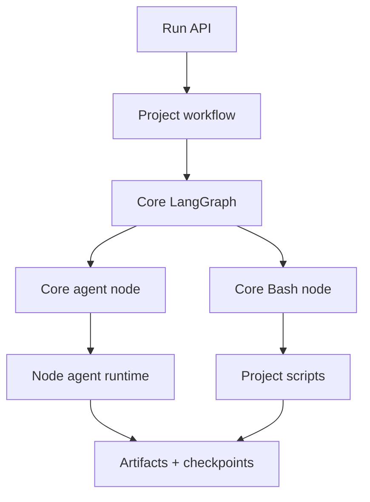

## PoC goal

Build a local, API-triggered LangGraph agent system with a clear split:

* **Core nodes** provide reusable orchestration and execution primitives.
* **Project workflows** decide the ordered agent prompts, Bash scripts, inputs, and failure paths.

A project workflow can therefore run:

```text
prepare → planner prompt → inspect → coder prompt → validate → reviewer prompt → package
```

without adding a new LangGraph node for planner, coder, reviewer, or any project-specific command.

## Architecture



## Monorepo layout

```text
repo/
├── apps/
│   ├── run-api/                         # starts, queries, cancels runs
│   └── agent-service/                   # loads workflows and serves LangGraph
├── packages/
│   ├── workflow-core/
│   │   ├── graph.ts                     # reusable LangGraph graph
│   │   ├── state.ts                     # generic run state
│   │   ├── types.ts                     # WorkflowStep and result contracts
│   │   ├── registry.ts                  # project/workflow lookup
│   │   ├── nodes/
│   │   │   ├── initialize.ts
│   │   │   ├── advance.ts
│   │   │   ├── agent.ts                 # generic LLM execution
│   │   │   ├── bash.ts                  # generic script execution
│   │   │   └── publish.ts
│   │   ├── artifacts.ts
│   │   └── persistence.ts                # PostgreSQL checkpointer
│   ├── agent-runtime/
│   │   └── run-agent.ts                 # controlled opencode wrapper
│   └── agent-contracts/
│       ├── agent-result.ts
│       └── command-result.ts
├── projects/
│   └── example-service/
│       ├── workflow.ts                  # project workflow definition
│       ├── prompts/
│       │   ├── planner.md
│       │   ├── coder.md
│       │   └── reviewer.md
│       ├── scripts/
│       │   ├── prepare-workspace.sh
│       │   ├── collect-context.sh
│       │   ├── apply-patch.sh
│       │   ├── validate.sh
│       │   └── package-artifacts.sh
│       └── policy.ts                    # allowed prompts, scripts, paths, limits
└── infra/langgraph/
    └── docker-compose.yaml
```

## Core nodes

Core nodes are project-agnostic. They do not contain prompt text, repository commands, test commands, or domain logic.

| Core node    | Responsibility                                                          |
| ------------ | ----------------------------------------------------------------------- |
| `initialize` | Creates run ID, ephemeral workspace, artifact prefix, and initial state |
| `advance`    | Selects the next declared workflow step and routes execution            |
| `agent`      | Resolves an approved prompt and calls the Node `opencode` runtime       |
| `bash`       | Resolves an approved project script and executes it in the workspace    |
| `publish`    | Writes final status and artifact manifest                               |

The reusable graph is:

```ts
const graph = new StateGraph(RunState)
  .addNode("initialize", initializeRun)
  .addNode("advance", advanceWorkflow)
  .addNode("agent", agentNode)
  .addNode("bash", bashNode)
  .addNode("publish", publishSummary)
  .addEdge(START, "initialize")
  .addEdge("initialize", "advance")
  .addConditionalEdges("advance", routeStep, {
    agent: "agent",
    bash: "bash",
    publish: "publish",
  })
  .addEdge("agent", "advance")
  .addEdge("bash", "advance")
  .addEdge("publish", END)
  .compile({ checkpointer });
```

## Core state and contracts

```ts
type WorkflowStep =
  | AgentStep
  | BashStep
  | PublishStep;

type AgentStep = {
  kind: "agent";
  id: string;
  prompt: string;
  inputs: string[];
  onFailure?: "publish";
};

type BashStep = {
  kind: "bash";
  id: string;
  script: string;
  inputs: string[];
  onFailure?: "publish";
};
```

```ts
const RunState = new StateSchema({
  run: RunManifest,
  workflow: WorkflowDefinition,
  task: TaskRequest,
  currentStep: WorkflowStep,
  stepIndex: z.number(),
  results: ResultsReducer,
  status: RunStatus,
});
```

Core state stores compact results and artifact references only. Full command output, model responses, patches, and prompt snapshots are stored as artifacts.

## Core agent node

```ts
export async function agentNode(state: RunStateType) {
  const step = assertAgentStep(state.currentStep);
  const project = getProject(state.run.projectId);
  const prompt = project.prompts[step.prompt];

  const result = await runAgent({
    promptFile: prompt.path,
    role: step.prompt,
    model: state.run.model,
    input: {
      run: state.run,
      task: state.task,
      upstream: selectResults(state.results, step.inputs),
      stepId: step.id,
    },
  });

  return addResult(step.id, "agent", result);
}
```

The same node executes every agent turn:

```bash
agent-runtime run \
  --role <workflow-selected-prompt> \
  --input /tmp/agent-input.json \
  --output /tmp/agent-result.json \
  --prompt <project-prompt-file> \
  --model opencode/big-pickle
```

## Core Bash node

```ts
export async function bashNode(state: RunStateType) {
  const step = assertBashStep(state.currentStep);
  const project = getProject(state.run.projectId);
  const script = project.scripts[step.script];

  const result = await runScript({
    path: script.path,
    workspace: state.run.workspace,
    input: selectResults(state.results, step.inputs),
    idempotencyKey: `${state.run.id}:${step.id}`,
  });

  return addResult(step.id, "bash", result);
}
```

The core only runs scripts registered by the selected project. It never evaluates agent-generated shell text.

## Project-specific workflow

`projects/example-service/workflow.ts` owns the order and semantics:

```ts
export default defineWorkflow({
  id: "example-service-code-review",
  version: 1,

  steps: [
    bashStep("prepare", "prepare-workspace"),

    agentStep("plan", "planner", {
      inputs: ["task", "prepare"],
    }),

    bashStep("collect-context", "collect-context", {
      inputs: ["plan"],
    }),

    agentStep("implement", "coder", {
      inputs: ["task", "plan", "collect-context"],
    }),

    bashStep("apply-patch", "apply-patch", {
      inputs: ["implement"],
      onFailure: "publish",
    }),

    bashStep("validate", "validate", {
      inputs: ["apply-patch"],
      onFailure: "publish",
    }),

    agentStep("review", "reviewer", {
      inputs: ["plan", "implement", "validate"],
    }),

    bashStep("package", "package-artifacts", {
      inputs: ["review"],
    }),

    publishStep("publish"),
  ],
});
```

The workflow is ordinary TypeScript, so it remains inspectable and testable. No custom runtime workflow language or graph compiler is introduced.

## Project policy

Each project supplies a policy:

```ts
export const policy = {
  prompts: ["planner", "coder", "reviewer"],
  scripts: [
    "prepare-workspace",
    "collect-context",
    "apply-patch",
    "validate",
    "package-artifacts",
  ],
  workspacePaths: ["src", "tests", "package.json"],
  maxAgentTurns: 3,
  maxCommandSeconds: 900,
  allowRepositoryWrite: false,
};
```

The core validates every requested prompt, script, input reference, path, and limit against this policy before execution.

## API

```http
POST /runs
GET  /runs/:runId
POST /runs/:runId/cancel
```

A run request selects a project workflow:

```json
{
  "project": "example-service",
  "workflow": "example-service-code-review",
  "task": "Add a health-check endpoint",
  "model": "opencode/big-pickle"
}
```

The API cannot supply arbitrary prompts or commands.

## Reliability and security

* PostgreSQL checkpointing uses `thread_id = agent-run/<run-id>`.
* Agent and Bash steps use `run_id + step_id` idempotency keys.
* Scripts run in an ephemeral workspace with a restricted environment.
* Commands have timeouts, output limits, and cancellation support.
* Logs and artifacts are redacted before publication.
* Deterministic Bash validation can skip subsequent agent steps.
* Neither node receives repository-write, deployment, or production credentials.

## Implementation phases

1. **Core runtime**

   * Implement generic state, graph, dispatcher, agent node, Bash node, artifact store, and checkpointer.

2. **Project registration**

   * Add project registry loading and validate workflow/policy contracts.

3. **Example workflow**

   * Add `example-service` prompts, scripts, policy, and linear workflow.

4. **Deterministic gates**

   * Implement patch application, lint, tests, and secret scan as project Bash scripts.

5. **Operations**

   * Add API status/cancel, artifact retention, log redaction, concurrency limits, and recovery tests.

6. **Demonstration**

   * Show success, model failure, malformed agent output, Bash failure, invalid patch, failed tests, and restart recovery.

## Definition of done

The PoC is complete when:

* core code contains no project prompt or script;
* a project workflow controls the sequence of generic agent and Bash nodes;
* the same agent node executes planner, coder, and reviewer prompts;
* deterministic project scripts gate subsequent steps;
* all results and artifacts are persisted and inspectable;
* no target repository or external system is mutated.
